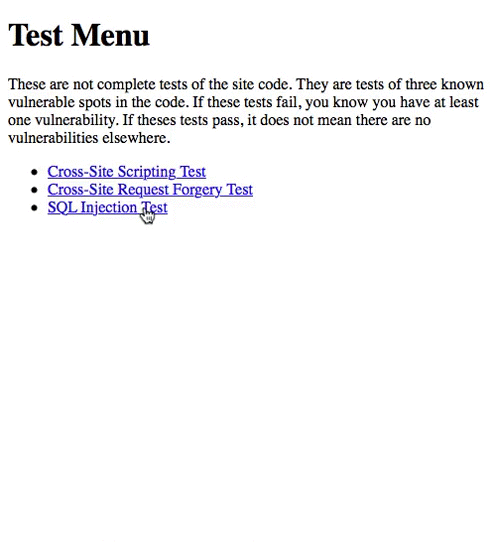

# Project 4 - Forgery, Theft, and Hijacking Prevention

Time spent: 4.5 hours spent in total

## User Stories

The following **required** functionality is completed:

1\. [X]  Required: Test for initial vulnerabilities

2\. [X]  Required: Configure sessions
  * [X]  Required: Only allow session IDs to come from cookies
  * [X]  Required: Expire after one day
  * [X]  Required: Use cookies which are marked as HttpOnly

3\. [X]  Required: Complete Login page.
  * [X]  Required: Show an error message when username is not found.
  * [X]  Required: Show an error message when username is found but password does not match.
  * [X]  Required: After login, store user ID in session data.
  * [X]  Required: After login, store user last login time in session data.
  * [X]  Required: Regenerate the session ID at the appropriate point.

4\. [X]  Required: Require login to access staff area pages.
  * [X]  Required: Add a login requirement to *almost all* staff area pages.
  * [X]  Required: Write code for `last_login_is_recent()`.

5\. [X]  Required: Complete Logout page.
  * [X]  Required: Add code to destroy the user's session file after logging out.

6\. [X]  Required: Add CSRF protections to the state forms.
  * [X]  Required: Create a CSRF token.
  * [X]  Required: Add CSRF tokens to forms.
  * [X]  Required: Compare tokens against the stored version of the token.
  * [X]  Required: Only process forms data sent by POST requests.
  * [X]  Required: Confirm request referer is from the same domain as the host.
  * [X]  Required: Store the CSRF token in the user's session.
  * [X]  Required: Add the same CSRF token to the login form as a hidden input.
  * [X]  Required: When submitted, confirm that session and form tokens match.
  * [X]  Required: If tokens do not match, show an error message.
  * [X]  Required: Make sure that a logged-in user can use pages as expected.

7\. [X]  Required: Ensure the application is not vulnerable to XSS attacks.

8\. [X]  Required: Ensure the application is not vulnerable to SQL Injection attacks.

9\. [X]  Required: Run all tests from Objective 1 again and confirm that your application is no longer vulnerable to any test.

The following advanced user stories are optional:

* [X]  Bonus Objective 1: Identify security flaw in Objective #4 (requiring login on staff pages)
  * [X]  Identify the security principal not being followed.

         I guess it is not following the principal of 'Expect the unexpected'.
         It is using two cases to define the cases to be false and letting the rest be true.
         There maybe some corner cases that the hacker can pass through the test in an unexpected way.

  * [X]  Write a short description of how the code could be modified to be more secure.

         We could modify it by making it pass through the test under certain situation.
         Right now we have 2 cases that will return false when either is failed and the rest return true.
         All we need to do is to reverse the testing, by only returning true when both cases passed and the rest return false.
         It can make sure that the test will only pass in our expected cases.

* [X] Bonus Objective 2: Add CSRF protections to all forms in the staff directory

* [X]  Bonus Objective 3: CSRF tokens only valid for 10 minutes.

* [X]  Bonus Objective 4: Sessions are valid only if user-agent string matches previous value.

* [X]  Advanced Objective: Set/Get Signed-Encrypted Cookie
  * [X]  Create "public/set\_secret\_cookie.php".
  * [X]  Create "public/get\_secret\_cookie.php".
  * [X]  Encrypt and sign cookie before storing.
  * [X]  Verify cookie is signed correctly or show error message.
  * [X]  Decrypt cookie.

## Video Walkthrough

Here's a walkthrough of implemented user stories:

## Notes

My computer has some problem that even if mysql is running, it cannot find the local host at all. 
I need to use the virtual environment (c9.io) to continue the development. 
The default PHP 5.5.9. Although I have uploaded to PHP 7.0.16-3, I still cannnot run random_bytes().
I have to use md5() to replace its functionality.

## License

    Copyright 2017 Chi Hon Law

    Licensed under the Apache License, Version 2.0 (the "License");
    you may not use this file except in compliance with the License.
    You may obtain a copy of the License at

        http://www.apache.org/licenses/LICENSE-2.0

    Unless required by applicable law or agreed to in writing, software
    distributed under the License is distributed on an "AS IS" BASIS,
    WITHOUT WARRANTIES OR CONDITIONS OF ANY KIND, either express or implied.
    See the License for the specific language governing permissions and
    limitations under the License.